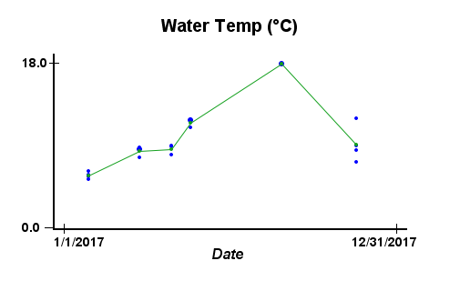
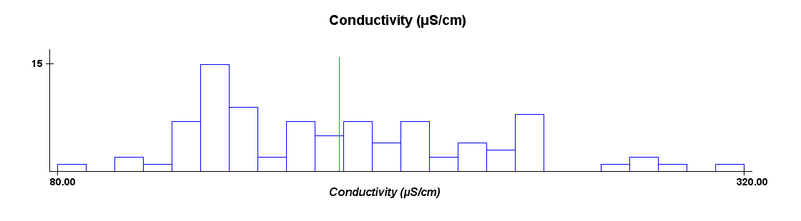

# LWWIP Stream-Monitoring Data Project

As part of my 3rd year at the Lake Washington Watershed 
Internship Program (LWWIP), I chose to do a technical project, 
particularly analyzing and visualizing our stream monitoring 
data.

Note: This project began in November 2018, and was 
added to GitHub in March 2019.

## Description

Once the program is running, and after an input file is
entered, the user is presented with a menu, with four
options:
```
Menu:
        w to write cleaned data to file
        a to analyze data statistically
        v to visualize the data
        q to quit
```

Note: **Analyze** and **Visualize** are complements to each
other, in that looking at a particular data set using both
options will give you the most information about the data.

### Write (w)

```
Enter an option (m to see the menu): w

Output file name (end with .tsv): data_3-2019.tsv
Done! Output file data_3-2019.tsv created.
```

This feature cleans the data, including standardizing
the units, and prints the contents to a new output file,
named by the user. This output file is created in the same
directory as the .jar file.

Note: This output file is not the same format as
the input file, so use this feature carefully.
For instance, some data is printed in the format
of Java's MultiValuedMap. See 
[out/artifacts/lwwip_stream_monitoring_data_project_jar/data_3-2019.tsv](https://github.com/dormantleopard7/lwwip-stream-monitoring-data-project/blob/master/out/artifacts/lwwip_stream_monitoring_data_project_jar/data_3-2019.tsv).
for a sample generated output file.

### Analyze (a)

```
Enter an option (m to see the menu): a

Enter dates in format mm/dd/yy or mm/dd/yyyy.
Start date (leave blank if want first data date): 1/1/18
Start date set to 1/1/2018
End date (leave blank if want today's date): 12/31/18
End date set to 12/31/2018
Site (1 or 2; 0 if want both): 1
Data type {1=Turbidity (NTU), 2=Turbidity (m), 3=Air Temp (°C), 4=Water Temp (°C), 5=pH, 6=DO (ppm), 7=Conductivity (μS/cm)}: 3
Chosen data type: Air Temp (°C)

Resulting Statistics
--------------------
Mean: 11.619047619047619
Standard Deviation: 5.892700815627273
Mode (frequency 7): [10.0]
Min, Q1, Median, Q3, Max: [2.0, 8.0, 10.0, 15.0, 25.0]
Outliers (based on 3 std devs): []
Outliers (based on 1.5 IQRs): []
```

This feature prints out statistics regarding data in the
given date range, at the given site, and for the given data
type. 

#### Data Options

##### Date Range

```
Enter dates in format mm/dd/yy or mm/dd/yyyy.
Start date (leave blank if want first data date): 1/1/18
Start date set to 1/1/2018
End date (leave blank if want today's date): 12/31/18
End date set to 12/31/2018
```

The dates must be entered in mm/dd/yy or mm/dd/yyyy format
to be interpreted correctly. 
If you want the default dates, just leave the line blank and
hit *return*. The start date defaults to the first date with
data (it will print something like `Start date set to 1/14/2006`)
and the end date defaults to the current date (it will print
something like `End date set to 6/29/2019`).
As always, it is best to make sure the date range is valid 
to avoid breaking the program or producing weird results.
If a date is invalid, it will prompt something like
`Invalid date, try again. Start date (leave blank if want first data date): `
until a valid date is entered.
If a range is invalid (i.e. the start date is after the end date,
or the date range contains no data), this will be identified
later in the program, when output is to be produced.

##### Site

```
Site (1 or 2; 0 if want both): 1
```

We have two sites at Coal Creek, 1 and 2, so enter one of
these based on the site you want. If you want to look at
Coal Creek as a whole, and thus want both sites' data,
enter 0. If anything other than the numbers 0, 1 or 2
is entered, it will prompt 
`Invalid site number, try again. Enter 1, 2, or 0: `
until a valid site number is entered.

##### Data Type

```
Data type {1=Turbidity (NTU), 2=Turbidity (m), 3=Air Temp (°C), 4=Water Temp (°C), 5=pH, 6=DO (ppm), 7=Conductivity (μS/cm)}: 3
Chosen data type: Air Temp (°C)
```

There are seven possible data types to analyze, and they
are numbered 1 to 7 (note that 1 and 2 are both turbidity,
but with different units). If anything other than a number
between 1 and 7, inclusive, is entered, it will prompt
`Invalid data type, try again. Enter a number from 1 to 7: `
until a valid data type is entered.

#### Resulting Statistics

```
Resulting Statistics
--------------------
Mean: 11.619047619047619
Standard Deviation: 5.892700815627273
Mode (frequency 7): [10.0]
Min, Q1, Median, Q3, Max: [2.0, 8.0, 10.0, 15.0, 25.0]
Outliers (based on 3 std devs): []
Outliers (based on 1.5 IQRs): []
```

##### Mean
This is simply the average of the data.

##### Standard Deviation (SD)
Standard deviation measures how spread out the data is.
It is calculated by taking the square root of the average
of the squares of the differences between each data point
and the mean. In a normal bell
curve, this means that 68% of the data is within 1 SD
of the mean, 95% of the data is within 2 SDs of the mean, 
and 99.7% of the data is within 3 SDs of the mean.

##### Mode
This is the most frequent data value in the data. The frequency
of that value is also printed. If there are multiple data
values with the same highest frequency, they are all listed
(in sorted order). If all values have a frequency of 1, then
rather than printing all values, it prints
`Mode (frequency 1): all data unique`.

##### Box-Plot Statistics
I call these box-plot statistics because they are the five
points needed to create a box-and-whiskers plot.
These are: the minimum, the first quartile (Q1, the data value
below which approx. 25% of the data lies), the median
(the middle value, a.k.a. the second quartile), the third
quartile (Q3, below which is 75% of the data), and the maximum.

##### Outliers
There are many ways to calculate outliers, and I have 
provided two. The first is based on the standard deviation;
as discussed above, in a normal curve, 99.7% of the data lies
within 3 SDs of the mean, so anything outside of that can be
considered an outlier. The second is based on the Inter-quartile
Range (IQR), which is the difference between Q1 and Q3; any
data that lies below of 1.5 IQR from Q1 or above 1.5 IQR from Q3
can be considered an outlier.

Note: Often, the two measures of outliers will produce different
results, usually where the 1.5 IQR list of outliers is larger.
Thus, it is up to you to decide how to interpret these results,
based on what you might know about the data, and what you are
given regarding the SD and IQR.

### Visualize (v)

```
Enter an option (m to see the menu): v

Enter dates in format mm/dd/yy or mm/dd/yyyy.
Start date (leave blank if want first data date): 1/1/17
Start date set to 1/1/2017
End date (leave blank if want today's date): 12/31/17
End date set to 12/31/2017
Site (1 or 2; 0 if want both): 2
Data type {1=Turbidity (NTU), 2=Turbidity (m), 3=Air Temp (°C), 4=Water Temp (°C), 5=pH, 6=DO (ppm), 7=Conductivity (μS/cm)}: 4
Chosen data type: Water Temp (°C)
(S)catter plot OR (H)istogram: s

Scatter Plot Generated! See new open window for graphics.

Enter an option (m to see the menu): v

Enter dates in format mm/dd/yy or mm/dd/yyyy.
Start date (leave blank if want first data date): 1/1/16
Start date set to 1/1/2016
End date (leave blank if want today's date): 12/31/16
End date set to 12/31/2016
Site (1 or 2; 0 if want both): 0
Data type {1=Turbidity (NTU), 2=Turbidity (m), 3=Air Temp (°C), 4=Water Temp (°C), 5=pH, 6=DO (ppm), 7=Conductivity (μS/cm)}: 5
Chosen data type: pH
(S)catter plot OR (H)istogram: h
Bucket Size means the range of values contained within one bar of the histogram.
Bucket Size (0 for individual counts): 0

Printing individual counts (no graphics window).

7.00   : ***********
7.20   : *
7.25   : *****
7.40   : *
7.50   : **********************************************************
7.75   : *****
8.00   : ****
8.50   : ***

Enter an option (m to see the menu): v

Enter dates in format mm/dd/yy or mm/dd/yyyy.
Start date (leave blank if want first data date): 
Start date set to 1/14/2006
End date (leave blank if want today's date): 
End date set to 6/30/2019
Site (1 or 2; 0 if want both): 0
Data type {1=Turbidity (NTU), 2=Turbidity (m), 3=Air Temp (°C), 4=Water Temp (°C), 5=pH, 6=DO (ppm), 7=Conductivity (μS/cm)}: 7
Chosen data type: Conductivity (μS/cm)
(S)catter plot OR (H)istogram: h
Bucket Size means the range of values contained within one bar of the histogram.
Bucket Size (0 for individual counts): 10.0

Histogram:

[80.00   -   90.00) : *
[90.00   -  100.00) : 
[100.00  -  110.00) : **
[110.00  -  120.00) : *
[120.00  -  130.00) : *******
[130.00  -  140.00) : ***************
[140.00  -  150.00) : *********
[150.00  -  160.00) : **
[160.00  -  170.00) : *******
[170.00  -  180.00) : *****
[180.00  -  190.00) : *******
[190.00  -  200.00) : ****
[200.00  -  210.00) : *******
[210.00  -  220.00) : **
[220.00  -  230.00) : ****
[230.00  -  240.00) : ***
[240.00  -  250.00) : ********
[250.00  -  260.00) : 
[260.00  -  270.00) : 
[270.00  -  280.00) : *
[280.00  -  290.00) : **
[290.00  -  300.00) : *
[300.00  -  310.00) : 
[310.00  -  320.00) : *
counts (from 80.00 to 320.00): [1, 0, 2, 1, 7, 15, 9, 2, 7, 5, 7, 4, 7, 2, 4, 3, 8, 0, 0, 1, 2, 1, 0, 1]
Histogram generated! See new open window for graphics.
```

#### Data Options

These are the same as the **Data Options** under **Analyze** above.

#### Scatter Plot

```
Enter an option (m to see the menu): v

Enter dates in format mm/dd/yy or mm/dd/yyyy.
Start date (leave blank if want first data date): 1/1/17
Start date set to 1/1/2017
End date (leave blank if want today's date): 12/31/17
End date set to 12/31/2017
Site (1 or 2; 0 if want both): 2
Data type {1=Turbidity (NTU), 2=Turbidity (m), 3=Air Temp (°C), 4=Water Temp (°C), 5=pH, 6=DO (ppm), 7=Conductivity (μS/cm)}: 4
Chosen data type: Water Temp (°C)
(S)catter plot OR (H)istogram: s

Scatter Plot Generated! See new open window for graphics.
```



The options required from the user for generating a scatter
plot are exactly the same as for analysis. This generates
a graph that is a bit more sophisticated than a simple 
scatter plot.

##### Data Points (blue)
The data points in blue are like normal scatter plot data 
points. The difference is that a larger data point means 
more people/groups recorded that value on that day. Thus,
we can be more confident with data coming from larger data
dots.

##### Average Line (green)
The green data points and line connects the average value
for each day that data was collected. Thus, it is a bit easier
to see potential outliers.

##### Title, Axes, Labels
All scatter plots have a title of the data type plotted
(which signifies the y-axis label), and an x-axis label
of the Date. On the y-axis, 0.0 is marked, as well as the
maximum value on the graph, all to scale. On the x-axis, 
the start and end date are marked, to scale.

##### The Graphics Window
The image is generated and shown in a new graphics window
(whose icon is the Java logo). Under *File*, the useful
feature is *Save As...*. Under *View*, you can zoom in and
out, and you can click grid lines if it helps read the
graph better.

#### Histogram

```
Enter an option (m to see the menu): v

Enter dates in format mm/dd/yy or mm/dd/yyyy.
Start date (leave blank if want first data date): 
Start date set to 1/14/2006
End date (leave blank if want today's date): 
End date set to 6/30/2019
Site (1 or 2; 0 if want both): 0
Data type {1=Turbidity (NTU), 2=Turbidity (m), 3=Air Temp (°C), 4=Water Temp (°C), 5=pH, 6=DO (ppm), 7=Conductivity (μS/cm)}: 7
Chosen data type: Conductivity (μS/cm)
(S)catter plot OR (H)istogram: h
Bucket Size means the range of values contained within one bar of the histogram.
Bucket Size (0 for individual counts): 10.0

Histogram:

[80.00   -   90.00) : *
[90.00   -  100.00) : 
[100.00  -  110.00) : **
[110.00  -  120.00) : *
[120.00  -  130.00) : *******
[130.00  -  140.00) : ***************
[140.00  -  150.00) : *********
[150.00  -  160.00) : **
[160.00  -  170.00) : *******
[170.00  -  180.00) : *****
[180.00  -  190.00) : *******
[190.00  -  200.00) : ****
[200.00  -  210.00) : *******
[210.00  -  220.00) : **
[220.00  -  230.00) : ****
[230.00  -  240.00) : ***
[240.00  -  250.00) : ********
[250.00  -  260.00) : 
[260.00  -  270.00) : 
[270.00  -  280.00) : *
[280.00  -  290.00) : **
[290.00  -  300.00) : *
[300.00  -  310.00) : 
[310.00  -  320.00) : *
counts (from 80.00 to 320.00): [1, 0, 2, 1, 7, 15, 9, 2, 7, 5, 7, 4, 7, 2, 4, 3, 8, 0, 0, 1, 2, 1, 0, 1]
Histogram generated! See new open window for graphics.
```



The options required from the user to generate a histogram
are the same as for analysis and for scatter plot, with the
addition of *bucket size*.

##### Bucket Size
Bucket size means the range of data values contained within
one bar of the histogram. For instance, in the above example,
a bucket size of 10.0 means each bar counts data within its
range of 10.0; i.e. 80 to 90, 90 to 100, 100 to 110, etc.
If an invalid bucket size is entered, or the bucket size
entered is too low, it will prompt
`Invalid bucket size; make sure it is a number above 1.0E-4. Bucket Size (0 for individual counts): `
until a valid bucket size is entered. It is advised that 
the bucket size be well over 0.0001 (it should really never
be lower than 0.5, unless it's 0 for individual counts -- see below).

###### Individual Counts

```
Enter an option (m to see the menu): v

Enter dates in format mm/dd/yy or mm/dd/yyyy.
Start date (leave blank if want first data date): 1/1/16
Start date set to 1/1/2016
End date (leave blank if want today's date): 12/31/16
End date set to 12/31/2016
Site (1 or 2; 0 if want both): 0
Data type {1=Turbidity (NTU), 2=Turbidity (m), 3=Air Temp (°C), 4=Water Temp (°C), 5=pH, 6=DO (ppm), 7=Conductivity (μS/cm)}: 5
Chosen data type: pH
(S)catter plot OR (H)istogram: h
Bucket Size means the range of values contained within one bar of the histogram.
Bucket Size (0 for individual counts): 0

Printing individual counts (no graphics window).

7.00   : ***********
7.20   : *
7.25   : *****
7.40   : *
7.50   : **********************************************************
7.75   : *****
8.00   : ****
8.50   : ***
```

A bucket size of 0 is interpreted as individual counts,
which prints a horizontal histogram (made of asterisks;
see **Text Histogram** below).

##### Text Histogram
A text histogram is always generated and printed out to
the same console that the user interacts with. It consists
of horizontal "bars" made of asterisks, where each asterisk
represents one data point. A bar's range is printed before
the asterisks for that bar (e.g. `[80.00   -   90.00)`).
Below the text histogram is a list of counts, which shows
how many data points are in each bar, in case you don't
want to count all the asterisks for a bar (e.g. 
`counts (from 80.00 to 320.00): [1, 0, 2, 1, 7, 15, 9, 2, 7, 5, 7, 4, 7, 2, 4, 3, 8, 0, 0, 1, 2, 1, 0, 1]`
translates to 1 data point between 80 and 90, 0 between
90 and 100, 2 between 100 and 110, etc.). Note that the
bars are inclusive at the beginning of a range, and
exclusive at the end of a range (so a bucket is really
80.0000 to 89.9999, 90.0000 to 99.9999, etc.).

##### Graphical Histogram

A graphical histogram is also generated, and shown in a
new window.

###### Bars(blue)
These are just like normal bars in a histogram. The
bars are right next to each other (without space in
between) because this is a histogram, and all the data
is continuous. The higher the bar is, the more data
points there are within that bar, to scale.

###### Average line (green)
This is a thing green line in the middle of the
histogram, indicating the mean data value. This
helps spot outliers and any discrepancies between
the mean and mode (highest bar).

###### Title, Axes, Labels
The title and x-axis labels are both the data type.
The highest count is marked on the y-axis, and the 
x-axis indicates count 0, to scale. The x-axis is
marked with the beginning of the lowest bucket and
the end of the highest bucket, to scale.

##### The Graphics Window
See above under **Scatter Plot** for the functionalities
of the graphics window.

### Quit (q)
This is pretty self-explanatory, but this ends the program.
Note that for this to work, all of the open graphics windows
(with the scatter plots and histograms and such) must be closed.
Otherwise, press *Ctrl-C* in Command Prompt at any point
during the program to terminate it. To get the program up and
running again, you can use the
`java -jar lwwip-stream-monitoring-data-project.jar` command.
Tip: Use the up arrow on your keyboard to see/run past commands
run in Command Prompt.

NOTE: A full run of the program can be found below in **Usage**.
More information about running the program can be found below
in **Installation**, especially in step 5.

## Installation

For this project to work correctly, you must have Java
downloaded on your machine, and be able to navigate to 
a directory (folder) using a terminal window. The
following instructions will help with this, and should
be enough to get the program up and running on your
computer.

NOTE: These instructions are mainly meant for Windows,
though usage instructions for Mac or Linux should be quite 
similar (e.g. using terminal instead of Command Prompt).

NOTE: These instructions are meant for anyone to run
the program. They are not meant for development purposes.
If you would like to work on the code (say, to expand on
it as part of your LWWIP project), please contact me.

1. **Download Java.** 
    * Follow the instructions 
[here](https://courses.cs.washington.edu/courses/cse142/17au/software/jdk.html)
to get the Java Development Kit (JDK) on your machine.
This is necessary for running the program.
        * Note: You
    may already have Java downloaded on your computer (e.g. 
    school laptops already have Java). If this is the case, you
    may skip this step, but still make sure to verify the installation
    as instructed below.
    * IMPORTANT: Make sure to follow the instructions
    to verify  the installation at the bottom of the
    above linked page, under *Installing the JDK > Windows*,
    where it checks the `java -version`. If it claims 
    that `'java' is not recognized as an internal or external command`, 
    then there is the extra step of setting up the Java
    Path Variable:
        * Open Control Panel. One way to do this is to
        hold down the *Windows* key and press *R*, then
        type *control panel*.
        * In the search bar at the top right of Control
        Panel, search for *environment* and one or two
        results may show up. If you have admin privileges,
        click *Edit the system environment variables*,
        then click *Environment Variables...* at the bottom right.
        Otherwise, click *Edit environment variables for
        your account*.
        * In the new open window, the top half should be
        *User variables for Username* and the bottom should be
        *System variables*. If you have admin privileges,
        click on the *Path* or *PATH* variable in *System
        Variables* and click *Edit...*. Otherwise, do the
        same in the *User variables* section.
        * In the new open window, click *New* and type the
        path to the *bin* file for your Java installation.
        This should be something like `C:\Program Files\Java\jdk-12.0.1\bin`.
        Once done, click *OK* then *OK* then exit out of
        Control Panel.
        * Now verify that the installation worked again,
        using the same `cmd /K java -version` from *Run*.
        This is mainly to check that the `java` command
        works at Command Prompt.
2. **Download the program.** 
    * Navigate to 
[out/artifacts/lwwip_stream_monitoring_data_project_jar/lwwip-stream-monitoring-data-project.jar](https://github.com/dormantleopard7/lwwip-stream-monitoring-data-project/blob/master/out/artifacts/lwwip_stream_monitoring_data_project_jar/lwwip-stream-monitoring-data-project.jar)
within the project structure here. Click *Download*.
    * Note: It is advised that you store this file in an
easy-to-access directory like Desktop, Downloads, or 
Documents, as it will make a later step (5) easier.
3. **Download the raw data.** 
    * You can find our Coal Creek data as a Google Sheet 
[here](https://docs.google.com/spreadsheets/d/13m4NraA7xr7I0MvVwElQNLROCSjlR1wWpsUXs-TIdJM/edit#gid=0).
Go to *File > Download as > Tab-separated values (.tsv, 
current sheet)*. Save this file to the same folder/directory 
as the .jar file from step 2. 
    * It is advised that you name the file to be short
    and easy to remember (preferably without spaces),
    rather than the default name. This will make typing
    in the file name when running (step 5) easier.
    * You can find a sample raw
data file in 
[out/artifacts/lwwip_stream_monitoring_data_project_jar/coal_creek_data_3-2019_raw.tsv](https://github.com/dormantleopard7/lwwip-stream-monitoring-data-project/blob/master/out/artifacts/lwwip_stream_monitoring_data_project_jar/coal_creek_data_3-2019_raw.tsv).
        * Note: The format of your data file must match the format
of this file (i.e. same order of headers).
4. **Get the data ready.**
Assuming there aren't any issues with the data, this
is a simple step: 
    * Open the .tsv file from step 3 with
a text editor (right click on the file, Open with...)
        * Notepad, the default text editor on 
Windows, works fine, but if you would like, you may
download/use (for free) a more sophisticated text editor like 
[Sublime Text](https://www.sublimetext.com/).
    * Delete the first line (the headers line) completely.
This means that the new first line of the file should 
contain data (in the case of our data, this new first
line begins with 5/12/2006). 
        * You can find a sample ready data file in
[out/artifacts/lwwip_stream_monitoring_data_project_jar/coal_creek_data_3-2019.tsv](https://github.com/dormantleopard7/lwwip-stream-monitoring-data-project/blob/master/out/artifacts/lwwip_stream_monitoring_data_project_jar/coal_creek_data_3-2019.tsv).
        * Note: In text editors without line numbers,
like Notepad, it might be hard to figure out when the
first line ends. For our data, the first line (which we
want to delete) begins with *Date* and ends with *Notes*.
Make sure that you completely delete this first line --
this means that there should not be a blank line in its
place; instead the first line must be a line with data.
5. **Run the program.**
    * To do this, you need to open a Command Prompt (or Terminal)
window. You can do this by holding down the *Windows* key
and pressing *R*, then typing *cmd*. This will open *cmd.exe*
in your home directory (likely something similar to 
`C:\Users\Username`, where `Username` is your computer
username). 
    * Now you need to navigate to the
directory with your .jar and .tsv files. 
        * To do this, you
will likely only need two commands: `cd` (change 
directory), and `dir` (list the contents of the 
current directory). 
            * Note: If you accidentally
go into the wrong directory, you can type `cd ..` to go
back up one directory. 
                * Also, fun fact: you can press
*tab* to auto-complete a directory or file in cmd. 
            * If you
would like more help with Command Prompt, there are
numerous basic online tutorials like 
[this one](https://www.cs.princeton.edu/courses/archive/spr05/cos126/cmd-prompt.html).
        * If you stored them in an easy directory,
this could be as simple as the one command `cd Desktop`
or `cd Downloads`. Otherwise, it could be a bit more complicated,
but it still only requires `dir` and `cd`. 
    * Once you are in the correct directory, run the command:
`java -jar lwwip-stream-monitoring-data-project.jar`
        * Tip: start typing `java -jar lwwip` (basically
        start typing the jar file name), then press *tab* 
for auto-complete. 
        * It should prompt for a file name; 
enter the name of the .tsv data file (including `.tsv`). 
            * If there are no errors and it displays 
a Menu, then you should be good to go! The program is 
now running, and you should be able to analyze and 
visualize the data! 
            * If the input file is invalid, it should
            print `INVALID INPUT FILE.` and halt the
            program. Make sure to enter the file name/path
            exactly as it is.
        * Note: For info on how to end/restart the program,
            see above in **Description**, under **Quit**.
    * Note: You may put the .tsv file 
in a different location than the .jar file, though it
requires a bit more work: When prompted for the
file name, enter the path to the file, either from
the root (from `C:` down; something like 
`C:/Users/Username/Desktop/coal_creek_data_3-2019.tsv`), or from the current
directory (something line `data/coal_creek_data_3-2019.tsv`).

## Usage

**Example Run** (run from within [out/artifacts/lwwip_stream_monitoring_data_project_jar](https://github.com/dormantleopard7/lwwip-stream-monitoring-data-project/blob/master/out/artifacts/lwwip_stream_monitoring_data_project_jar))
```
C:\Users\Username>cd Desktop
C:\Users\Username\Desktop>java -jar lwwip-stream-monitoring-data-project.jar

Enter the stream data .tsv file name/path.
Specify the path from the root directory or from the current directory.
File name/path: coal_creek_data_3-2019.tsv

Menu:
        w to write cleaned data to file
        a to analyze data statistically
        v to visualize the data
        q to quit

Enter an option (m to see the menu): a

Enter dates in format mm/dd/yy or mm/dd/yyyy.
Start date (leave blank if want first data date): 1/1/18
Start date set to 1/1/2018
End date (leave blank if want today's date): 12/31/2018
End date set to 12/31/2018
Site (1 or 2; 0 if want both): 1
Data type {1=Turbidity (NTU), 2=Turbidity (m), 3=Air Temp (°C), 4=Water Temp (°C), 5=pH, 6=DO (ppm), 7=Conductivity (?S/cm)}: 3
Chosen data type: Air Temp (°C)

Resulting Statistics
--------------------
Mean: 11.619047619047619
Standard Deviation: 5.892700815627273
Mode (frequency 7): [10.0]
Min, Q1, Median, Q3, Max: [2.0, 8.0, 10.0, 15.0, 25.0]
Outliers (based on 3 std devs): []
Outliers (based on 1.5 IQRs): []

Enter an option (m to see the menu): v

Enter dates in format mm/dd/yy or mm/dd/yyyy.
Start date (leave blank if want first data date): 1/1/17
Start date set to 1/1/2017
End date (leave blank if want today's date): 12/31/17
End date set to 12/31/2017
Site (1 or 2; 0 if want both): 2
Data type {1=Turbidity (NTU), 2=Turbidity (m), 3=Air Temp (°C), 4=Water Temp (°C), 5=pH, 6=DO (ppm), 7=Conductivity (?S/cm)}: 4
Chosen data type: Water Temp (°C)
(S)catter plot OR (H)istogram: s

Scatter Plot Generated! See new open window for graphics.

Enter an option (m to see the menu): v

Enter dates in format mm/dd/yy or mm/dd/yyyy.
Start date (leave blank if want first data date): 1/1/16
Start date set to 1/1/2016
End date (leave blank if want today's date): 12/31/16
End date set to 12/31/2016
Site (1 or 2; 0 if want both): 0
Data type {1=Turbidity (NTU), 2=Turbidity (m), 3=Air Temp (°C), 4=Water Temp (°C), 5=pH, 6=DO (ppm), 7=Conductivity (?S/cm)}: 5
Chosen data type: pH
(S)catter plot OR (H)istogram: H
Bucket Size means the range of values contained within one bar of the histogram.
Bucket Size (0 for individual counts): 1

Histogram:

[7.00    -    8.00) : *********************************************************************************
[8.00    -    9.00) : *******
counts (from 7.00 to 9.00): [81, 7]
Histogram generated! See new open window for graphics.

Enter an option (m to see the menu): v

Enter dates in format mm/dd/yy or mm/dd/yyyy.
Start date (leave blank if want first data date):
Start date set to 1/14/2006
End date (leave blank if want today's date):
End date set to 7/5/2019
Site (1 or 2; 0 if want both): 0
Data type {1=Turbidity (NTU), 2=Turbidity (m), 3=Air Temp (°C), 4=Water Temp (°C), 5=pH, 6=DO (ppm), 7=Conductivity (?S/cm)}: 7
Chosen data type: Conductivity (?S/cm)
(S)catter plot OR (H)istogram: h
Bucket Size means the range of values contained within one bar of the histogram.
Bucket Size (0 for individual counts): 10.0

Histogram:

[80.00   -   90.00) : *
[90.00   -  100.00) :
[100.00  -  110.00) : **
[110.00  -  120.00) : *
[120.00  -  130.00) : *******
[130.00  -  140.00) : ***************
[140.00  -  150.00) : *********
[150.00  -  160.00) : **
[160.00  -  170.00) : *******
[170.00  -  180.00) : *****
[180.00  -  190.00) : *******
[190.00  -  200.00) : ****
[200.00  -  210.00) : *******
[210.00  -  220.00) : **
[220.00  -  230.00) : ****
[230.00  -  240.00) : ***
[240.00  -  250.00) : ********
[250.00  -  260.00) :
[260.00  -  270.00) :
[270.00  -  280.00) : *
[280.00  -  290.00) : **
[290.00  -  300.00) : *
[300.00  -  310.00) :
[310.00  -  320.00) : *
counts (from 80.00 to 320.00): [1, 0, 2, 1, 7, 15, 9, 2, 7, 5, 7, 4, 7, 2, 4, 3, 8, 0, 0, 1, 2, 1, 0, 1]
Histogram generated! See new open window for graphics.

Enter an option (m to see the menu): m

Menu:
        w to write cleaned data to file
        a to analyze data statistically
        v to visualize the data
        q to quit

Enter an option (m to see the menu): q


C:\Users\Username\Desktop>
```
Note: For visualization, graphical charts are
generated and will open in a new window, where the user
can zoom in and out, and save the image as a .png,
as explained in the **Visualize (v)** section of
**Description** above.

Note: When it shows `Conductivity (?S/cm)`, this is
simply because Command Prompt does not recognize the
μ (mu, for micro) symbol. It is supposed to be `Conductivity (μS/cm)`.

## Support

Additional information regarding the project can
be found in [ProjectPresentation.pptx](https://github.com/dormantleopard7/lwwip-stream-monitoring-data-project/blob/master/ProjectPresentation.pptx),
which is the slide deck from my 3rd Year Project Presentation.
It includes motivations for the project, the process
I took, an overview of the functionality (basically a
less-detailed version of the **Description** above),
many charts regarding our data (and what they might mean),
and more.

Please contact me if you have any issues or questions.

## Authors and acknowledgement
Almost all of the code for this project was written by me.
The exception is 
[DrawingPanel.java](https://github.com/dormantleopard7/lwwip-stream-monitoring-data-project/blob/master/src/main/DrawingPanel.java),
which was written by Professors Stuart Reges and Marty Stepp, and provided
much of what was necessary for the graphics in this project to work.
I would also like to thank Eli Arao for inspiring the
project, Ian Schooley and Lisa Keith for supervising
the project, and Laura Dean for offering a UX designer's
perspective on the project and its possibilities.